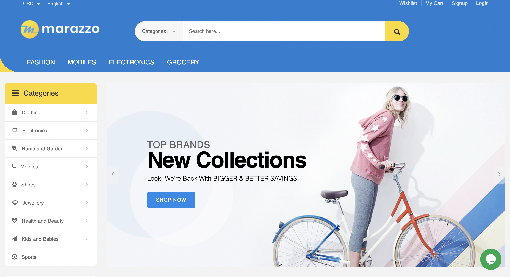

# marazzo.store E-commerce Website

## Table of contents

- [Introduction](#introduction)
- [Demo](#demo)
- [Run](#run)
- [Technology](#technology)
- [Features](#features)
- [License](#license)

## Introduction

A virtual ecommerce website using Node js, Express js, and MongoDb.

NOTE: Please read the RUN section before opening an issue.

## Demo

The application is deployed to Digital Ocean and can be accessed through the following link:

[marazzo.store on DigitalOcean](https://marazzo.store/)

The website resembles a real store and you can add products to your cart and wishlist and pay for them. If you want to try the checkout process, you can use the dummy card number/ upi/ Internet Bankinng provided by Razorpay for testing . Please <u><b>DO NOT</b></u> provide real card number and data.

In order to access the admin panel on "/admin" you need to provide the admin email and password.

## Run

To run this application, you have to set your own environmental variables. For security reasons, some variables have been hidden from view and used as environmental variables with the help of dotenv package. Below are the variables that you need to set in order to run the application:

- CONNECTION_URL: This is the database connection url (string).

- RAZORPAY_KEY: This is the razorpay key_Id (string).

- RAZORPAY_SECRET: This is the razorpay key_Secret (string).

- FAST2SMSAPI: This is the Fast2sms Service Id (string).

- JWT_TOKEN: This is the jwt secret ket (string).

- RESET_PASSWORD_KEY: This is the jwt reset passsword secret key (string).

- GOOGLE_APP_PASS: This is the NodeMailer password (string)

- GOOGLE_APP_EMAIL: This is the NodeMailer gmail (string)

After you've set these environmental variables in the .env file at the root of the project, and intsall node modules using  `npm install`

Now you can run `npm start` in the terminal and the application should work.

## Technology

The application is built with:

- Node.js 
- MongoDB
- Express 
- Bootstrap 
- AJAX
- JQuery
- Razorpay
- SweetAlert
- NodeMailer

Deployed in DigitalOcean with Nginx reverse proxy

## Features

The application displays home and office furnitures and its information.

Users can do the following:

- Create an account, login or logout
- Browse available products added by the admin
- Add products to the shopping cart and wishlist
- Delete products from the shopping cart and wishlist
- Display the shopping cart
- To checkout, a user must be logged in
- Checkout information is processed using razorpay and the payment is send to the admin
- Product offers and coupons
- Invoice pdf generator
- The profile contains all the orders a user has made
- View order details and cancel the orders
- Update their profile
- Search and filter products
 

Admins can do the following:

- Login or logout to the admin panel
- Display sale report
- Add products
- Add categories
- Add subcategory
- View, edit or delete products
- Change the orders status
- Display the Orders done by the users
- View all orders done by users

## License

- MIT License
- Copyright 2022 © [Mohamed Sabith](https://github.com/mohamedsabith)
